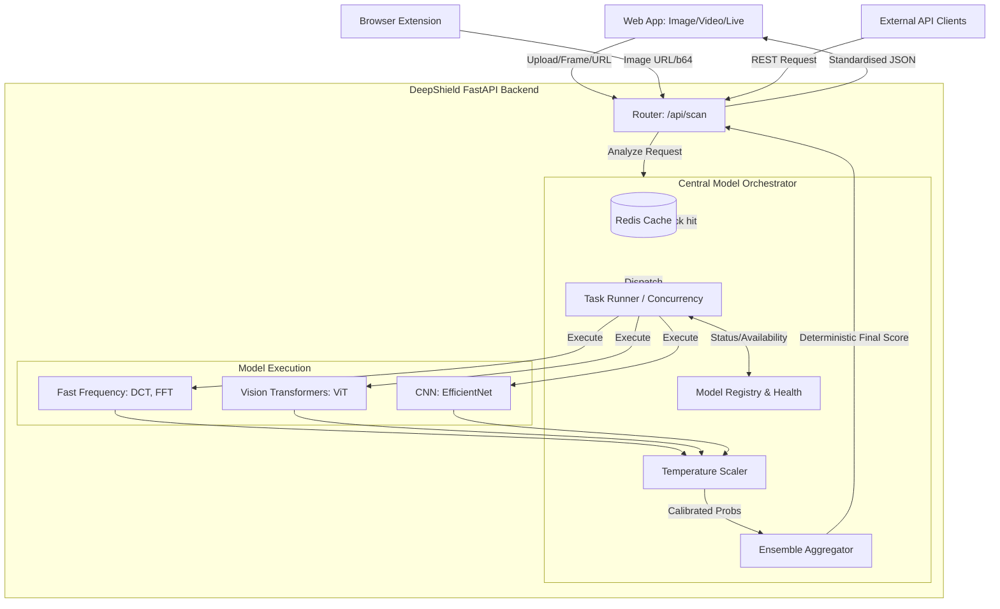

<div align="center">


# 🛡️ DeepShield AI (formerly KAVACH-AI)
### Unified Multimodal Deepfake Detection & Threat Intelligence Platform

[](https://github.com/abisheik687/deepfake-system)
[](https://semver.org)
[](https://python.org)
[](https://reactjs.org)
[](https://fastapi.tiangolo.com)
[](https://docker.com)
[](LICENSE)

[🚀 Request Demo](https://kavach-ai.demo) · [🐛 Report Bug](https://github.com/abisheik687/deepfake-system/issues) · [✨ Request Feature](https://github.com/abisheik687/deepfake-system/issues)

</div>

---

## 📖 Overview

**DeepShield AI** (formerly KAVACH-AI) is a production-ready, highly-scalable threat intelligence platform engineered to detect and analyze AI-generated synthetic media (deepfakes). The system is entirely driven by a **Central Model Orchestrator**—a single authoritative pipeline that fuses multiple state-of-the-art vision and frequency models via temperature-scaled soft voting to produce a deterministic, high-confidence Deepfake Risk Score (0-100).

Built for **trust and safety teams**, **digital forensic laboratories**, and **media integrity units**, DeepShield AI provides:

- 🔬 **High-Confidence Verdicts** — Triangulates data from ViT, EfficientNet, and Frequency models through weighted ensemble fusion.
- 🚀 **Unified Orchestration** — A single, highly optimized endpoint (`/api/scan`) handles static images, full videos, and real-time live webcams.
- ⚡ **Real-Time Live Enforcement** — Optimized <100ms pipeline utilizing fast frequency models to protect live webcam feeds.
- 🧩 **Scalable Architecture** — Built with FastAPI, Celery, and Redis for concurrent model execution and intelligent caching.

---

## ⚡ Key Features

| Feature | Description |
| :--- | :--- |
| **🧠 Central Orchestrator** | A single authoritative pipeline managing concurrent model execution, caching, and health registries. |
| **🎥 Video Orchestration** | Temporal frame aggregation analyzes video streams across multiple models to find fleeting anomalies. |
| **🖼️ Image Analysis** | High-fidelity static image analysis using a balanced tier of ViT and Frequency models to detect sub-pixel manipulation. |
| **⚡ Live Enforcement** | Sub-100ms low-latency camera scanning using optimized frequency models. |
| **📊 Command Center** | Interactive visualization of global metrics, live detections, and threat severity. |
| **📈 Deterministic Scoring** | Results are normalized via temperature scaling and fused using weighted soft-voting to produce a uniform Risk Score. |
| **🐳 Dockerized Microservices** | Fully containerized architecture for reproducible, "one-click" deployment in any environment. |

---

## 🏗️ System Architecture

DeepShield AI follows a clean, orchestration-driven architecture ensuring a single source of truth for all deepfake analysis.



---

## 📂 Project Structure

```bash
deepshield-ai/
├── assets/                  # Project branding & media assets
│   └── kavach_ai_banner.png # Project logo & banner
├── backend/                 # Python/FastAPI Backend Service
│   ├── api/                 # REST API Routes
│   │   ├── scan.py          # Unified Scanner (orchestrator entry point) 
│   │   └── models_api.py    # Model configuration & registry API
│   ├── orchestrator/        # Central Orchestrator Core
│   │   ├── orchestrator.py  # Main pipeline manager
│   │   ├── task_runner.py   # Concurrent model execution
│   │   ├── ensemble_aggregator.py # Weighted soft voting 
│   │   └── temperature_scaler.py  # Probabilistic calibration
│   └── main.py              # FastAPI Application Entrypoint
├── frontend/                # React 18 / Vite Frontend
│   ├── src/
│   │   ├── api/             # Axios API Client & interceptors
│   │   ├── components/      # Reusable UI Components
│   │   ├── layout/          # Dashboard shell & navigation
│   │   ├── pages/           # Feature Views (HomePage, Dashboard, Scanners)
│   │   └── context/         # Global State Management (Auth Context)
│   └── Dockerfile           # Multi-stage Nginx production build
├── scripts/                 # Utility & setup scripts
├── tests/                   # Automated test suites
├── data/                    # Storage for uploads, DB files & evidence
├── docker-compose.yml       # Full-stack service orchestration
├── requirements.txt         # Python dependency manifest
├── setup.sh                 # Linux/macOS setup script
├── setup.bat                # Windows setup script
└── README.md                # Project documentation
```

---

## 🚀 Getting Started

### Prerequisites

- **Docker** (v24+) & **Docker Compose** (v2+)
- *Or* **Python** 3.9+ & **Node.js** 18+ *(for manual setup)*
- Minimum **8GB RAM** recommended for running AI inference models

---

### 🐳 Option A: Docker Deployment *(Recommended)*

The fastest way to get KAVACH-AI running with all services.

**1. Clone the Repository**
```bash
git clone https://github.com/abisheik687/deepfake-system.git
cd deepfake-system
```

**2. Configure Environment**
```bash
cp .env.example .env
# Edit .env to set your SECRET_KEY, database credentials, etc.
```

**3. Launch All Services**
```bash
docker-compose up --build -d
```

**4. Access the Platform**

| Service | URL |
|---|---|
| 🌐 Frontend Dashboard | [http://localhost:3000](http://localhost:3000) |
| ⚙️ API Documentation | [http://localhost:8000/docs](http://localhost:8000/docs) |
| 🔑 Default Login | `admin` / `admin` |

---

### 🔧 Option B: Manual Installation

<details>
<summary>Click to expand manual setup instructions</summary>

#### 1. Backend (FastAPI + Python)
```bash
cd backend
python -m venv venv
# Windows
venv\Scripts\activate
# Linux / macOS
source venv/bin/activate

pip install -r ../requirements.txt
uvicorn main:app --reload --port 8000
```

#### 2. Frontend (React + Vite)
```bash
cd frontend
npm install
npm run dev
```

#### 3. Required Services
Ensure the following services are running before starting:

| Service | Default Port | Purpose |
|---|---|---|
| PostgreSQL | 5432 | Primary relational database |
| Redis | 6379 | Task queue & caching layer |

#### 4. Database Initialization
```bash
# Run migrations
alembic upgrade head

# Create default admin user
python scripts/create_admin.py
```

</details>

---

## 📚 API Reference

The API is fully documented using **OpenAPI (Swagger UI)** at `http://localhost:8000/docs`.

### Authentication
| Method | Endpoint | Description |
|---|---|---|
| `POST` | `/auth/token` | Authenticate and retrieve a JWT access token |
| `POST` | `/auth/register` | Register a new analyst account |

### Scan & Analysis
| Method | Endpoint | Description |
|---|---|---|
| `POST` | `/api/scan/analyze-unified` | High-fidelity static image orchestrator pass |
| `POST` | `/api/scan/analyze-unified-video` | Temporal video frame aggregation |
| `POST` | `/api/scan/live-unified` | Sub-100ms ultra-low latency webcam scanning |

### Reports
| Method | Endpoint | Description |
|---|---|---|
| `GET` | `/reports/{scan_id}/pdf` | Download a forensic-grade PDF report for a scan |

---

## 🧠 AI Models

KAVACH-AI employs a three-stage AI pipeline for comprehensive media analysis:

| Model | Modality | Architecture | Purpose |
|---|---|---|---|
| **Frequency Models** | Live / Image | DCT, FFT | Catches sub-pixel anomalies and synthetic noise patterns. Optimized for <100ms live stream scanning. |
| **Vision Transformers** | Video / Image | ViT | High-fidelity spatial artifact detection across varying resolutions. |
| **EfficientNet** | Video / Image | CNN | Efficient spatial bounding and artifact detection. |
| **Fusion Engine** | All | Probabilistic Soft Voting | Combines model calibrations through temperature scaling into a final robust Risk Score limit (0-100). |

---

## 🤝 Contributing

Contributions from the security research and AI community are welcome! Please review our [CONTRIBUTING.md](CONTRIBUTING.md) before submitting a pull request.

1. 🍴 **Fork** the repository
2. 🌿 **Create** your feature branch (`git checkout -b feature/YourFeatureName`)
3. ✅ **Commit** your changes (`git commit -m 'feat: Add YourFeatureName'`)
4. 📤 **Push** to the branch (`git push origin feature/YourFeatureName`)
5. 🔁 **Open a Pull Request** with a clear description of your changes

---

## 🛡️ Security

If you discover a security vulnerability, please **do not open a public issue**. Instead, report it responsibly via the [GitHub Security Advisory](https://github.com/abisheik687/deepfake-system/security/advisories) feature.

---

## 📄 License

Distributed under the **MIT License**. See [`LICENSE`](LICENSE) for more information.

---

<div align="center">
  <p>Built with ❤️ for digital truth and media integrity by the <strong>KAVACH-AI Team</strong></p>
  <p>
    <a href="#">Privacy Policy</a> ·
    <a href="#">Terms of Service</a> ·
    <a href="https://github.com/abisheik687/deepfake-system">GitHub Repository</a>
  </p>
  <br/>
  <sub>⭐ If this project helps your research, please consider giving it a star!</sub>
</div>
