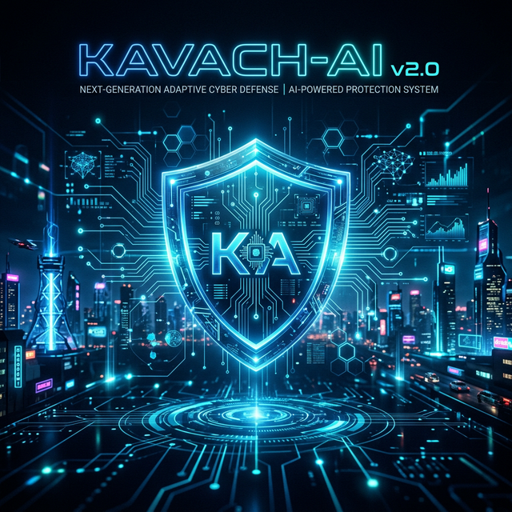
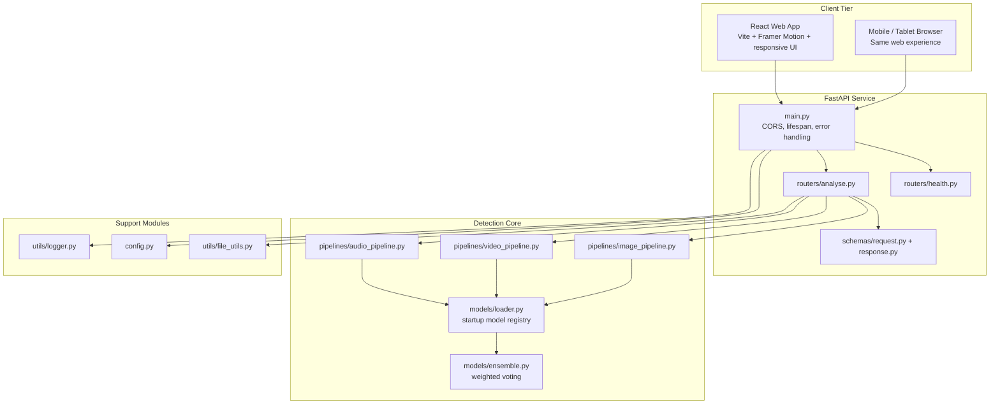
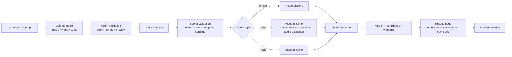

<!--
Internal trace:
- Wrong before: the README was accurate but sparse, with limited project understanding, no visual flow, and no polished onboarding path for a fresh user.
- Fixed now: the README is a professional landing page with banner imagery, architecture/workflow diagrams, project explanation, and the fresh-system one-command localhost bootstrap.
-->

# KAVACH-AI

<p align="center">
  <strong>DeepShield AI for upload-first deepfake detection</strong><br />
  A responsive web application for analysing image, video, and audio authenticity with a FastAPI backend and a modern React frontend.
</p>

<p align="center">
  
</p>

<p align="center">
  
  
  
  
</p>

---

## Project Understanding

KAVACH-AI is a **web-first deepfake detection platform** built around one reliable user journey: **upload, analyse, review, repeat**.

The repository was cleaned and reorganized so the active application is easy to understand:

- `backend/` contains the FastAPI service, validation, model loading, and image/audio/video pipelines.
- `frontend/` contains the responsive React application for upload, progress tracking, and result review.
- `legacy/` contains archived experiments and older realtime/dashboard code that is no longer part of the running product.

### What the active application does

- Accepts **image**, **video**, and **audio** uploads.
- Validates file type and file size before analysis.
- Runs a weighted deepfake scoring pipeline.
- Returns a readable result with verdict, confidence, model breakdown, warnings, waveform data, and sampled video frames when available.
- Works as a **fully web application**. The Chrome extension path has been removed.

---

## Architecture Diagram


```mermaid
flowchart TB
    subgraph Clients["Client Tier"]
        Web["React Web App\nVite + Framer Motion + responsive UI"]
        Mobile["Mobile / Tablet Browser\nSame web experience"]
    end

    subgraph Backend["FastAPI Service"]
        Main["main.py\nCORS, lifespan, error handling"]
        Health["routers/health.py"]
        Analyse["routers/analyse.py"]
        Schemas["schemas/request.py + response.py"]
    end

    subgraph Detection["Detection Core"]
        Loader["models/loader.py\nstartup model registry"]
        Ensemble["models/ensemble.py\nweighted voting"]
        ImagePipe["pipelines/image_pipeline.py"]
        VideoPipe["pipelines/video_pipeline.py"]
        AudioPipe["pipelines/audio_pipeline.py"]
    end

    subgraph Support["Support Modules"]
        Config["config.py"]
        Files["utils/file_utils.py"]
        Logger["utils/logger.py"]
    end

    Web --> Main
    Mobile --> Main
    Main --> Health
    Main --> Analyse
    Analyse --> Schemas
    Analyse --> ImagePipe
    Analyse --> VideoPipe
    Analyse --> AudioPipe
    ImagePipe --> Loader
    VideoPipe --> Loader
    AudioPipe --> Loader
    Loader --> Ensemble
    Main --> Config
    Analyse --> Files
    Main --> Logger
```

---

## Workflow Diagram


```mermaid
flowchart LR
    A["User opens web app"] --> B["Upload media\nimage / video / audio"]
    B --> C["Client validation\nsize + format + preview"]
    C --> D["POST /analyse"]
    D --> E["Server validation\nmime + size + temp file handling"]
    E --> F{"Media type"}
    F -->|Image| G["Image pipeline"]
    F -->|Video| H["Video pipeline\nframe sampling + optional audio extraction"]
    F -->|Audio| I["Audio pipeline"]
    G --> J["Weighted scoring"]
    H --> J
    I --> J
    J --> K["Verdict + confidence + warnings"]
    K --> L["Results page\nmodel scores, waveform, frame grid"]
    L --> M["Analyse another"]
```

---

## Active Repository Layout

```text
.
+-- backend/
¦   +-- main.py
¦   +-- config.py
¦   +-- routers/
¦   +-- models/
¦   +-- pipelines/
¦   +-- schemas/
¦   +-- utils/
¦   +-- requirements.txt
¦   +-- Dockerfile
+-- frontend/
¦   +-- src/
¦   ¦   +-- api/
¦   ¦   +-- components/
¦   ¦   +-- hooks/
¦   ¦   +-- pages/
¦   ¦   +-- styles/
¦   +-- package.json
¦   +-- Dockerfile
+-- docs/
¦   +-- API.md
¦   +-- INSTALL.md
¦   +-- CODEBASE_DIAGRAM.md
¦   +-- assets/banner.png
+-- legacy/
¦   +-- backend/
¦   +-- frontend/
¦   +-- root-docs/
¦   +-- scripts/
+-- docker-compose.yml
```

---

## Tech Stack

### Backend

- FastAPI
- Pydantic Settings
- Transformers
- Torch / Torchvision / timm
- OpenCV
- librosa / soundfile / scipy

### Frontend

- React
- Vite
- Framer Motion
- Tailwind CSS
- Axios
- Lucide Icons

### Runtime Strategy

- Primary startup path: **Docker Compose**
- Fallback path: **Python venv + npm**
- Environment bootstrapping via `.env.example` files

---

## Fresh-System One-Command Bootstrap (Windows PowerShell)

This is the optimized one-command bootstrap for a **fresh Windows system**. It installs missing tools, clones the repository if needed, creates env files, starts the active stack, waits for readiness, and opens the app on localhost.

```powershell
$repo = if (Test-Path '.git') { (Get-Location).Path } else { Join-Path $HOME 'kavach-ai' }; if (!(Get-Command git -ErrorAction SilentlyContinue) -and !(Test-Path "$Env:ProgramFiles\Git\cmd\git.exe")) { winget install --id Git.Git -e --accept-package-agreements --accept-source-agreements }; $git = if (Get-Command git -ErrorAction SilentlyContinue) { (Get-Command git).Source } else { "$Env:ProgramFiles\Git\cmd\git.exe" }; if (!(Test-Path (Join-Path $repo '.git'))) { & $git clone https://github.com/abisheik687/kavach-ai.git $repo }; Set-Location $repo; if (Test-Path '.env.example' -and !(Test-Path '.env')) { Copy-Item '.env.example' '.env' }; if (Test-Path 'backend\.env.example' -and !(Test-Path 'backend\.env')) { Copy-Item 'backend\.env.example' 'backend\.env' }; if (Test-Path 'frontend\.env.example' -and !(Test-Path 'frontend\.env')) { Copy-Item 'frontend\.env.example' 'frontend\.env' }; if (Test-Path 'docker-compose.yml') { if (!(Test-Path "$Env:ProgramFiles\Docker\Docker\Docker Desktop.exe")) { winget install --id Docker.DockerDesktop -e --accept-package-agreements --accept-source-agreements }; if (-not (Get-Process 'Docker Desktop' -ErrorAction SilentlyContinue)) { Start-Process "$Env:ProgramFiles\Docker\Docker\Docker Desktop.exe" }; $docker = "$Env:ProgramFiles\Docker\Docker\resources\bin\docker.exe"; do { Start-Sleep 5 } until (Test-Path $docker); do { Start-Sleep 5; try { & $docker info *> $null; $ready = $LASTEXITCODE -eq 0 } catch { $ready = $false } } until ($ready); & $docker compose up --build -d; do { Start-Sleep 5; try { $api = (Invoke-WebRequest 'http://localhost:8000/health' -UseBasicParsing -TimeoutSec 5).StatusCode -eq 200; $web = (Invoke-WebRequest 'http://localhost:4173' -UseBasicParsing -TimeoutSec 5).StatusCode -ge 200 } catch { $api = $false; $web = $false } } until ($api -and $web); Start-Process 'http://localhost:4173' } else { if (!(Get-Command py -ErrorAction SilentlyContinue)) { winget install --id Python.Python.3.11 -e --accept-package-agreements --accept-source-agreements }; if (!(Test-Path "$Env:ProgramFiles\nodejs\npm.cmd")) { winget install --id OpenJS.NodeJS.LTS -e --accept-package-agreements --accept-source-agreements }; py -3.11 -m venv .venv; .\.venv\Scripts\python.exe -m pip install --upgrade pip; .\.venv\Scripts\python.exe -m pip install -r backend\requirements.txt; & "$Env:ProgramFiles\nodejs\npm.cmd" ci --prefix frontend; Start-Process powershell -ArgumentList '-NoExit','-Command','Set-Location ''backend''; ..\.venv\Scripts\python.exe -m uvicorn main:app --host 0.0.0.0 --port 8000'; Start-Process powershell -ArgumentList '-NoExit','-Command','Set-Location ''frontend''; npm run dev -- --host 0.0.0.0 --port 4173'; do { Start-Sleep 5; try { $api = (Invoke-WebRequest 'http://localhost:8000/health' -UseBasicParsing -TimeoutSec 5).StatusCode -eq 200; $web = (Invoke-WebRequest 'http://localhost:4173' -UseBasicParsing -TimeoutSec 5).StatusCode -ge 200 } catch { $api = $false; $web = $false } } until ($api -and $web); Start-Process 'http://localhost:4173' }
```

### What the command does

- Installs **Git** if needed and clones the repo when you are not already inside it.
- Copies root, backend, and frontend `.env.example` files into working `.env` files.
- Prefers **Docker Compose** for the fastest reliable full-stack startup on a fresh machine.
- Falls back to **Python 3.11 + npm** if Docker is not available.
- Waits until both backend and frontend are reachable, then opens the app at `http://localhost:4173`.

---

## Standard Local Start

### Docker

```bash
docker compose up --build
```

### Manual Development

Backend:

```powershell
cd backend
..\.venv\Scripts\python.exe -m uvicorn main:app --reload
```

Frontend:

```powershell
cd frontend
npm run dev
```

---

## Localhost Endpoints

- Web App: `http://localhost:4173`
- Backend API: `http://localhost:8000`
- API Docs: `http://localhost:8000/docs`
- Health Check: `http://localhost:8000/health`

---

## Environment Files

The repository ships with these active templates:

- Root: `.env.example`
- Backend: `backend/.env.example`
- Frontend: `frontend/.env.example`

These defaults are already tuned for the active upload-first application.

---

## Notes for Contributors

- The **Chrome extension has been removed** from the active product path.
- The older realtime and experimental surfaces are preserved under `legacy/` for reference only.
- If Hugging Face model downloads are unavailable, the backend still runs using deterministic fallback scorers instead of fake placeholder outputs.
- Video audio extraction requires `ffmpeg`; the Docker backend image installs it automatically.

---

## Documentation

- [Installation Guide](./docs/INSTALL.md)
- [API Overview](./docs/API.md)
- [Architecture Diagram](./docs/CODEBASE_DIAGRAM.md)
- [Compliance Notes](./docs/COMPLIANCE.md)
- [Legacy Archive Notes](./legacy/README.md)
